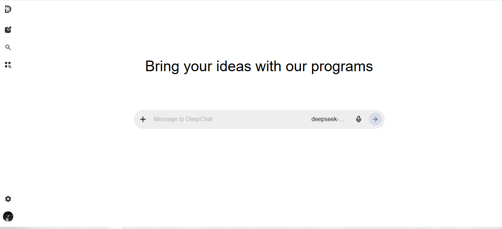
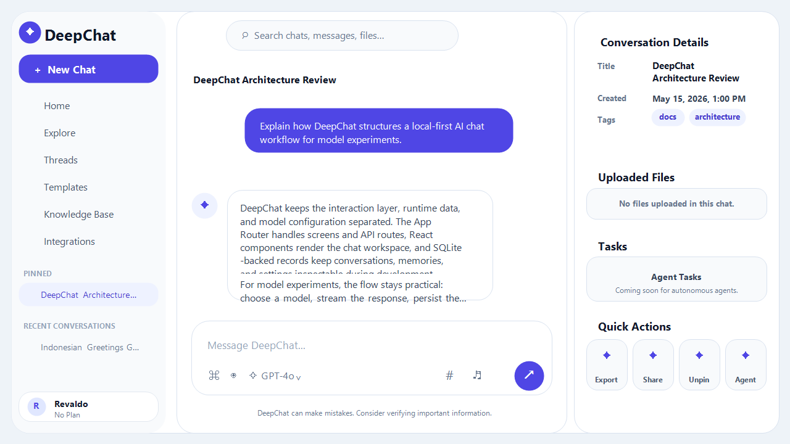

<div align="center">
  

  # DeepChat

  <p align="center">
    <strong>A next-generation, local-first AI chat workspace and agent environment.</strong>
  </p>

  <p align="center">
    <a href="https://img.shields.io/badge/status-active_development-blue?style=for-the-badge"></a>
    <a href="https://nextjs.org/"></a>
    <a href="https://react.dev/"></a>
    <a href="https://www.typescriptlang.org/"></a>
    <a href="https://tailwindcss.com/"></a>
    <a href="https://pnpm.io/"></a>
    <a href="./LICENSE"></a>
  </p>

  <p align="center">
    <a href="./README_id.md"><strong>Bahasa Indonesia (README_id.md)</strong></a>
  </p>
</div>

---

DeepChat is a feature-rich, local-first conversational workspace built with Next.js, React, and TypeScript. Inspired by the dynamic UX of ChatGPT and the agent-focused adaptability of OpenClaw, DeepChat provides a polished interface for advanced model experimentation, long-term memory extraction, interactive sandboxed code execution, and custom assistant behavior.

> [!WARNING]
> This application is currently under **active development**. Some features may change, break, or improve as the repository undergoes refinement toward stability.

---

## Key Capabilities

### Premium Mobile-First UI/UX
- Fully responsive interface designed layout-first for mobile devices, then seamlessly scaled for desktops.
- Sleek, modern design with glassmorphism touches, fluid animations powered by Framer Motion, and absolute focus on usability.
- Custom-tailored dark and light themes, collapsible sidebars, and customizable control panels.

### Semantic Long-Term Memory & Context
- Automated background memory extraction to build assistant understanding of the user.
- Persistent structured memories categorized by importance, time, and content type.
- Vectorizable history tracking to support semantic recall across multiple chat sessions.

### Deep Model Context Protocol (MCP) Integration
- Direct integration with Model Context Protocol servers to equip models with local and network tools.
- Granular MCP permissions, runtime tool configuration, and security gates.
- Built-in provider switcher with native support for the official Google GenAI SDK (Gemini models).

### Rich Developer Workflows & Sandboxes
- Full markdown layout with extensive LaTeX mathematical formula support (KaTeX) and GFM rendering.
- Syntax highlighting powered by Shiki for production-grade code readability.
- Embedded sandboxed execution environments to build, preview, and test generated code inside execution sessions.

### Local-First & Privacy Conscious
- Complete local persistence powered by SQLite via better-sqlite3 and type-safe schema mapping via Drizzle ORM.
- Private document directories where chats, logs, generated files, and profile details remain strictly on your local machine.

---

## Screenshots

### Home Screen


### Chat Screen


---

## Getting Started (Windows)

DeepChat is pre-configured with a powerful local launcher for Windows. You do not need to deal with manual console setups, dependency tracking, or server management.

### The Easiest Way: deepchat.bat

To launch DeepChat, simply double-click the **deepchat.bat** file in the root folder of the project.

#### What does the launcher do behind the scenes?
1. **Automated Directory Bootstrapping:** Safely creates the local file structure inside `data/` for chats, memories, temp artifacts, and logs.
2. **Dependency Manager:** Automatically checks if local packages are present. If missing, it runs a silent installation using `pnpm@10` tailored with specific build exclusions.
3. **Smart Incremental Compilation:** Compares modification timestamps of code in `src/`, `public/`, and configuration files against your latest build. If changes are detected, it builds the application; otherwise, it skips straight to runtime.
4. **Port Allocation & PID Resolution:** Validates port availability. If port 3000 is already in use by a previous DeepChat instance, it presents options to hot-reload, kill the occupying PID, or launch immediately in the browser.
5. **Network / LAN Auto-Discovery:** Resolves and displays both your local computer address and your local network IP (LAN), allowing you to interact with the chat from your phone, tablet, or secondary devices.
6. **Log Redirection & Log Filtering:** Filters out generic server requests while highlighting critical system operations and `[AI]` reasoning in clear color-coded console logs. Automatically launches the browser once server is ready.

---

## Manual & Advanced Commands

For developers who prefer terminal controls, DeepChat supports standardized scripts via pnpm:

### Package Installation
Provide this instruction to install dependencies manually:
```bash
pnpm install
```

### Local Development Server
Launches the development instance with Turbopack for near-instant hot reloading:
```bash
pnpm dev
```

### Production Operations
Generate the production bundle:
```bash
pnpm build
```
Launch the compiled production bundle:
```bash
pnpm start
```
Perform code linting to ensure compliance with production quality:
```bash
pnpm lint
```

---

## Workspace Architecture

```text
deepchat/
├── data/                       # Local runtime environment (gitignored)
│   ├── chat/                   # User sessions and conversational snapshots
│   ├── llm/                    # Connection configurations and prompt profiles
│   ├── temp/                   # Session files and temporary downloads
│   ├── user/                   # Memory tables and user metadata
│   ├── backups/                # Periodic database and configuration backups
│   └── logs/                   # System runtime logs and event histories
├── docs/                       # Technical documentations and workspace guides
│   └── screenshots/            # Visual layout references
├── public/                     # Static assets
│   ├── icon.svg                # Main application logo
│   └── icons/                  # Modular icon packages
├── scripts/                    # Automation scripts
│   └── deepchat-launcher.ps1   # PowerShell launcher backing deepchat.bat
├── src/                        # Primary React/Next.js codebase
│   ├── app/                    # Routing pages, layouts, actions, and styles
│   ├── components/             # Reusable UX modules and widgets
│   └── lib/                    # MCP settings, database layers, and generation scripts
├── package.json                # Project manifest and package configurations
├── tsconfig.json               # TypeScript rules and compilation schema
└── deepchat.bat                # Windows interactive execution entrypoint
```

---

## Status & Future Directions

This application is actively developing under the workspace structure of a localized AI. Future releases target:
- Deepening multi-model orchestration.
- Advanced vector database capabilities for semantic long-term memory retrieval.
- Comprehensive tool pipelines and external execution security gates.
- Polished integrations for the Model Context Protocol ecosystem.

---

## License

DeepChat is open-source software licensed under the MIT License. All local storage, generation workflows, and customization modules are free to adapt, extend, and deploy.
